# Widgets

Factsheets can be built using a selected set of widgets: Basic, Performance Analytics, and Factor Analytics. The Performance and Factor Analytics widgets are pre-calculated based on the uploaded return data and the selected benchmark.

## Basic

### CSV Key-Value Data

CSV format with two columns: `key`, `value`.

### CSV Table Data

CSV format with multiple columns representing tabular data.

### Factsheet Title

Displays a title and description for the factsheet.

### Free Text

Plain text input, up to 200 characters.

### Image

Upload `.jpg`, `.jpeg`, or `.png` images (maximum size: 2 MB).

### Time Series Chart

Upload time series data in CSV format.

## Performance Analytics

### Cumulative Performance Chart

The cumulative performance of an investment represents the total percentage change in the asset’s price over a specific period.

The data for this chart will be pre-calculated based on the provided return data.

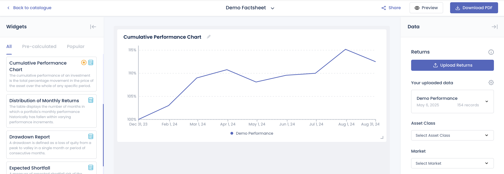

#### Widget Options

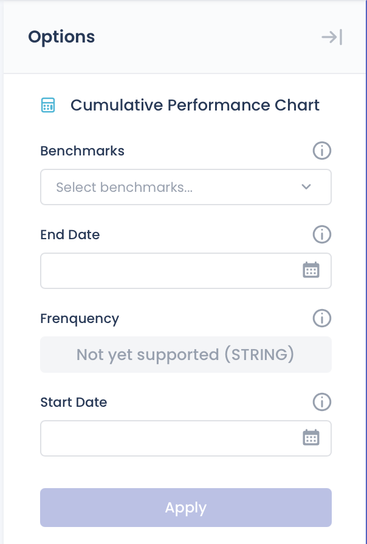

- **Benchmarks** - Select a benchmark from the list.
- **Start, End Date** - Set the date range for the displayed data.

### Distribution of Monthly Returns

The chart displays the number of months in which a portfolio's monthly performance historically has fallen within varying performance increments.

The data for this chart will be pre-calculated based on the provided return data.

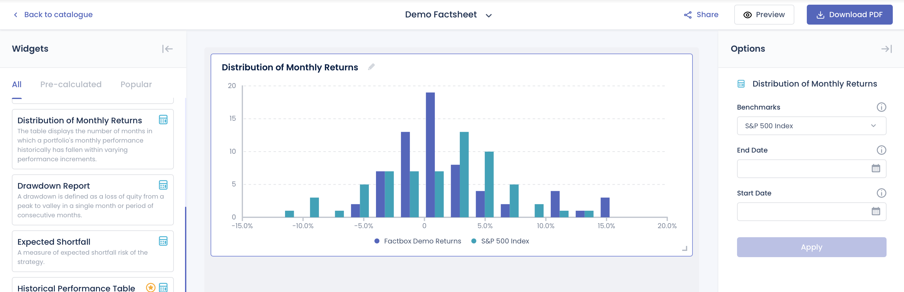

#### Widget Options

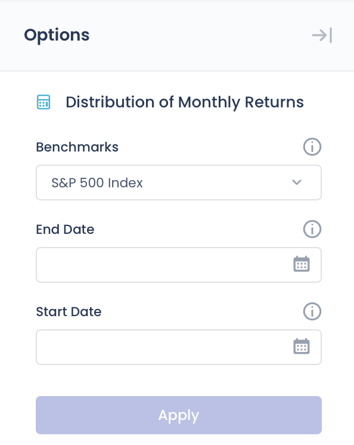

- **Benchmarks** - Select a benchmark from the list.
- **Start, End Date** - Set the date range for the displayed data.

### Drawdown Report

A drawdown is defined as a loss of equity from a peak to a trough within a single month or over a consecutive period of months.

The data for this chart will be pre-calculated based on the provided return data.

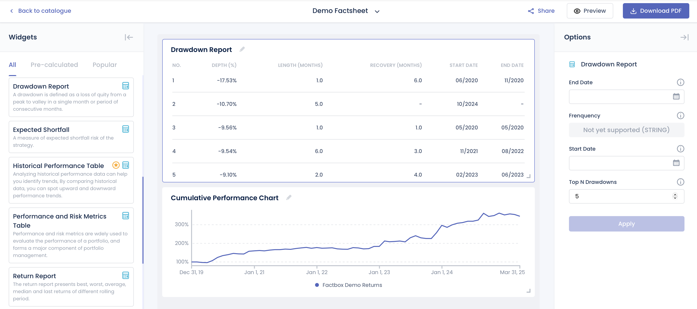

#### Widget Options

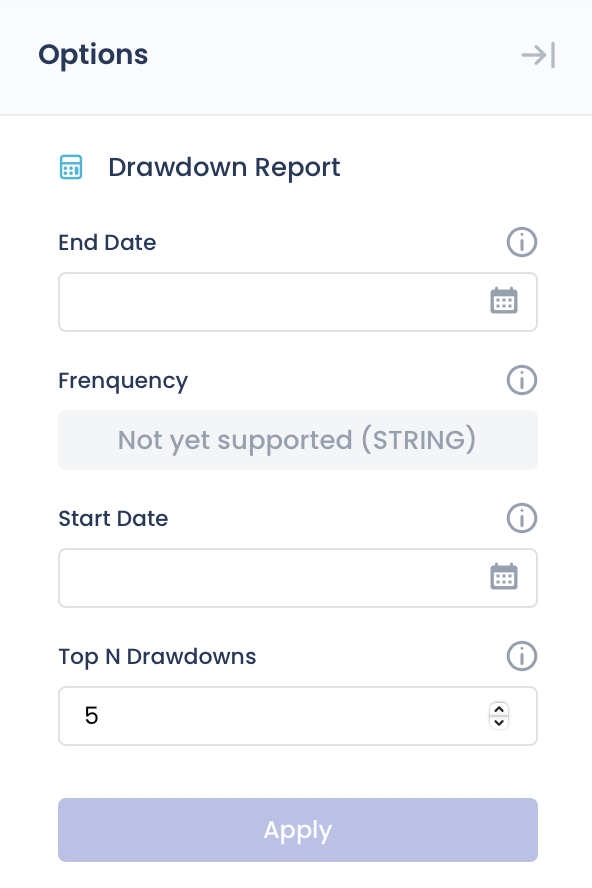

- **Top N Drawdowns** - Number of drawdown periods to display.
- **Start, End Date** - Set the date range for the displayed data.

### Expected Shortfall

Represents the expected shortfall risk associated with the returns data.

The data for this chart will be pre-calculated based on the provided return data.


#### Widget Options

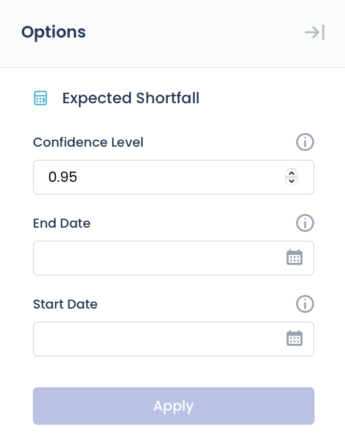

- **Confidence Level** - The probability that losses will not exceed the expected shortfall threshold. For example, a 95% confidence level means there is a 5% chance that losses will exceed the calculated expected shortfall.
- **Start, End Date** - Defines the time range over which the expected shortfall is calculated, based on the provided return data.

### Historical Performance Table

Analyzing historical performance data cah help you identify trends, by comparing historical data, you can spot upward and downward performance trends.

The data for this chart will be pre-calculated based on the provided return data.

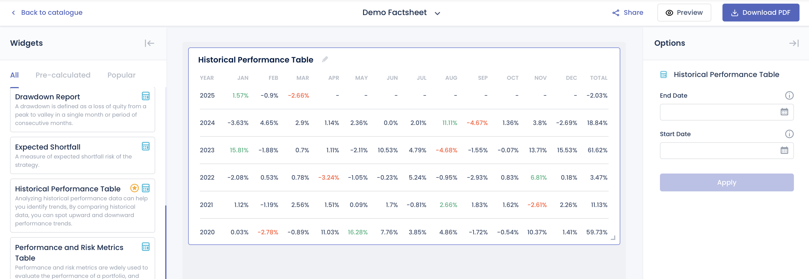

#### Widget Options

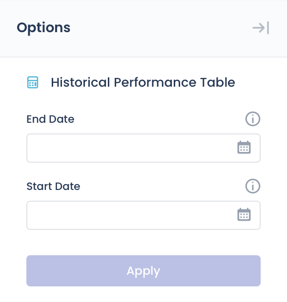

- **Start, End Date** - Sets the period for displaying historical performance metrics based on available return data.

### Performance and Risk Metrics

Performance and risk metrics are widely used to evaluate the performance of a portfolio, and forms a major component of portfolio management.

The data for this chart will be pre-calculated based on the provided return data.

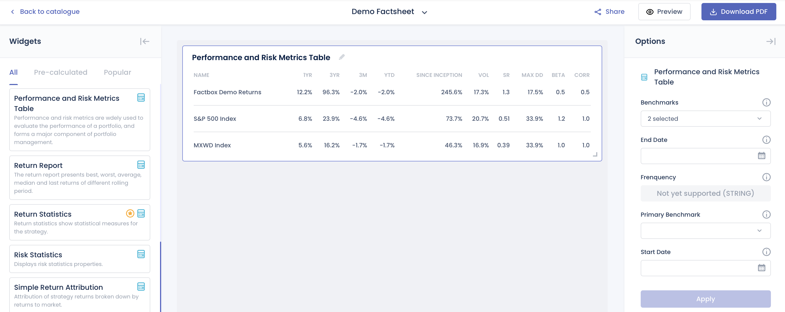

#### Widget Options

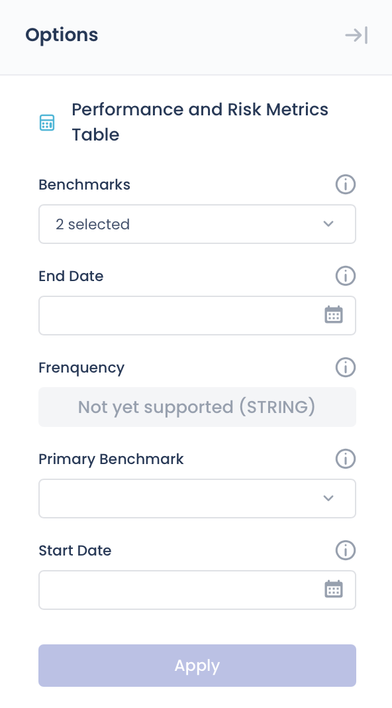

-**Benchmarks** - Compare performance metrics against selected benchmarks. Multiple selections allowed.
-**Prinmary Benchmark** - The main benchmark used for comparison.
- **Start, End Date** - Sets the time period for displaying historical performance metrics based on the available return data.

### Return Report

The return report represents best, worst, average, median and last returns of different rolling period.

The data for this chart will be pre-calculated based on the provided return data.

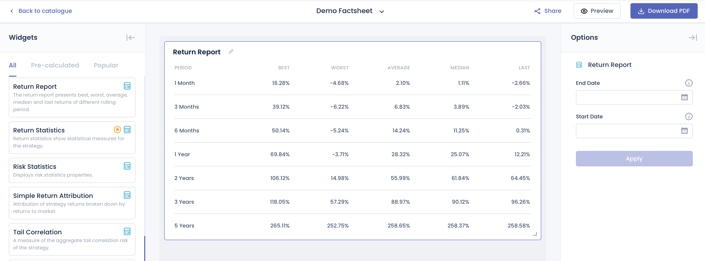

#### Widget Options

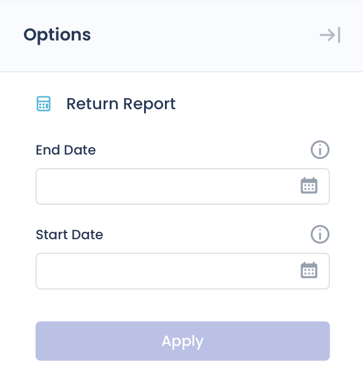

- **Start, End Date** - Defines the time window used to calculate and display rolling period return statistics.

### Return Statistics

Return statistics show statistical measures for the return data provided.

- **CAGR** - Compound Annual Growth Rate; the annualized rate of return assuming profits are reinvested over the period.
- **3 Month ROR** - Return on investment over the last 3 months, showing short-term performance.
- **6 Month ROR** - Return over the past 6 months, capturing medium-term performance trends.
- **1 Year ROR** - Return over the last 12 months, indicating recent yearly performance.
- **3 Year ROR** - Cumulative return over the past 3 years, useful for evaluating longer-term results.
- **Year to Date ROR** - Return from the beginning of the calendar year up to the current date.
- **Total Return** -  The overall return over the entire period, including both capital gains and income.
- **Winning Month** - The percentage of months with positive returns during the evaluated period.
- **Avg Winning Month** - The average return in months where the performance was positive.
- **Avg Losing Month** - The average return in months where the performance was negative.

The data for this widget will be pre-calculated based on the provided return data.

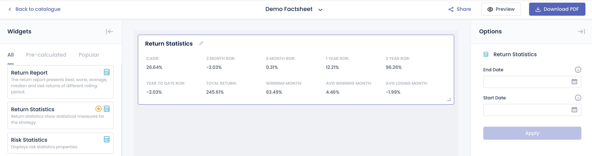

#### Widget Options

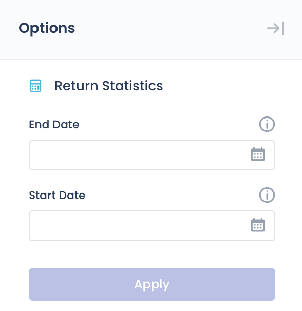

- **Start, End Date** - Defines the time window used to calculate and display rolling period return statistics.

### Risk Statistics

Display risk statistics properties.

The data for this widget will be pre-calculated based on the provided return data.

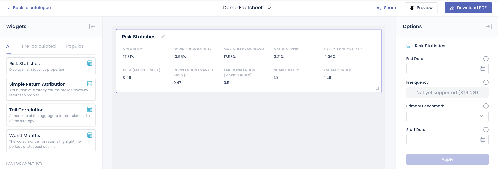

#### Volatility
Volatility measures how much returns vary on average over a year, based on daily return fluctuations.

**🧮 Formula**

$$
\text{Annualized Volatility} = \sigma \times \sqrt{\text{Yearly Length}}
$$

Where:
- $\sigma$: Standard deviation of the daily returns  
- $\text{Yearly Length}$: Number of trading periods per year (typically 252 for daily returns)

🧪 Python Code Example

```python
import numpy as np
import pandas as pd

def calculate_volatility(rets: pd.Series, scale: int = 252) -> float:
    """
    Calculate the annualized volatility (standard deviation) of returns.

    Args:
        rets: Series of periodic returns (e.g., daily or monthly)
        scale: Number of periods per year (252 for daily, 12 for monthly)

    Returns:
        Annualized volatility as a float
    """
    # Compute standard deviation of returns
    std_dev = rets.std()

    # Annualize the volatility
    volatility = std_dev * (scale ** 0.5)

    return volatility

```

#### Downside Volatility
Measure of downside risk that focuses on returns that fall below the risk-free benchmark. The risk-free benchmark will depend on the geography where the strategy/product is denominated and the market traded. For US and Global strategies/products, we will be using the 13 week Treasury Bill rate.

!!! note
    $$
    \text{Annual. Downside Volatility} =
    \sqrt{
    \frac{
    \sum_{t=1}^{n} \left[ \min(R_{st} - R_{ft}, 0) \right]^2
    }{n}
    \times \text{Trading Days per Year}
    }
    $$

    **Where:**

    - n: Total number of return observations  
    - min(X, Y): Returns the smaller of X and Y; used to isolate negative excess returns  
    - R_{st}: Strategy/Product return at time t  
    - R_{ft}: Risk-free return at time t
    - Trading Days per Year: 252

🧪 Python Code Example

```python
import numpy as np
import pandas as pd

def calculate_downside_volatility(excess_rets: pd.Series, scale: int = 252) -> float:
    """
    Calculate the annualized Downside Volatility from a series of excess returns.

    Downside Volatility focuses only on negative excess returns relative to a risk-free rate
    or benchmark, penalizing losses more than overall volatility.

    Args:
        excess_rets: Series of excess returns (strategy returns minus risk-free rate)
        scale: Number of periods per year (e.g., 252 for daily, 12 for monthly)

    Returns:
        Annualized downside volatility as a float
    """
    # Filter only negative excess returns
    negative_excess_rets = excess_rets[excess_rets < 0]

    # Square them, take the average (divide by total length of excess_rets, not just negative ones)
    downside_var = (negative_excess_rets**2).sum() / len(excess_rets)

    # Take square root of variance and scale it to annualize
    downside_volatility = (downside_var ** 0.5) * (scale ** 0.5)

    return downside_volatility

```

#### Maximum Drawdown
The largest peak-to-trough decline in value during a specific period, showing the worst potential loss.

!!! note
    **📉 Max Drawdown Calculation**

    The **maximum drawdown** measures the largest peak-to-trough decline in cumulative returns over a given time period.

    ---

    **🔹 Step 1: Compute Cumulative Returns**

    Define the cumulative returns series $C$:

    $$
    C = [C_1, C_2, \dots, C_T]
    $$

    Where each cumulative return $C_t$ at time $t$ is:

    $$
    C_t = \prod_{i=0}^{t} (1 + R_i)
    $$

    - $R_i$: Return at time $i$  
    - $t$: Index in the return series

    ---

    **🔹 Step 2: Compute Drawdown Series**

    Define the drawdown series $D$:

    $$
    D = [D_1, D_2, \dots, D_T]
    $$

    Each drawdown value $D_t$ is:

    $$
    D_t = \frac{C_t}{\max_{i=0}^{t}(C_i)} - 1
    $$

    - $\max_{i=0}^{t}(C_i)$: Maximum cumulative return up to time $t$

    ---

    **🔹 Step 3: Compute Maximum Drawdown**

    The **maximum drawdown** is the lowest point in the drawdown series (expressed as an absolute value):

    $$
    \text{Max Drawdown} = \left| \min(D) \right|
    $$

    Where:
    - $D$: The full drawdown time series  
    - $\min(D)$: The worst drawdown observed

🧪 Python Code Example

```python
import numpy as np
import pandas as pd 

def cal_underrater(rets: pd.Series) -> pd.Series:
    """
    Calculate the drawdown series from a return series.

    Args:
        rets: A pandas Series of periodic returns (e.g., daily or monthly)

    Returns:
        A Series representing drawdowns at each time point
    """
    # Compute cumulative returns over time: (1 + r1) * (1 + r2) * ... * (1 + rt)
    cum_rets = (rets + 1).cumprod()

    # Track the running maximum of cumulative returns (i.e., historical peaks)
    peak = np.maximum.accumulate(cum_rets)

    # Calculate drawdown at each point: how far below the peak the cumulative return is
    underrater = cum_rets / peak - 1

    return underrater

```

#### Value at Risk
Measures the extent of possible financial losses within the strategy/product over a specific time frame given a certain significance level (alpha). For the VaR, we will using the monthly returns as the input and the alpha specified will be 0.05.

!!! note

    The **Value at Risk** at a given significance level is calculated as:

    $$
    \text{Value at Risk} = Q(\alpha, \text{rets})
    $$

    Where:
    - $\alpha$: The significance level (e.g., 0.05 for 5%)
    - $\text{rets}$: All historical returns of the strategy
    - $Q$: Quantile function that returns the $\alpha$-th percentile of the return distribution

🧪 Python Code Example

```python
import numpy as np
import numpy.typing as npt
from typing import Dict

def calculate_var(rets: npt.ArrayLike, alpha: float = 0.05) -> float:
    """
    Calculate Value at Risk (VaR) at a given significance level.

    Args:
        rets: A NumPy array-like of strategy returns.
        alpha: Significance level (default is 0.05 for 5% VaR).

    Returns:
        The VaR value (a negative number indicating potential loss).
    """
    rets_array = np.asarray(rets)
    clean_rets = rets_array[~np.isnan(rets_array)]
    var = np.quantile(clean_rets, alpha)

    return var
```

#### Expected Shortfall 
Measures the weighted average of the "extreme" losses in the tail of the distribution of possible returns, beyond the VaR cutoff point and given a certain significance level (alpha).

!!! note

    The **Expected Shortfall** (also called Conditional Value at Risk) is the **average loss** in the worst-case $\alpha$ fraction of return outcomes.

    ---

    Given $\alpha < 0.05$:

    $$
    \text{ES} = \frac{1}{N_<} \sum_{i=1}^{N_<} x_i
    $$

    Where:
    - $N_<$: Number of returns less than the $\alpha$-quantile
    - $x_i$: Each return in that worst $\alpha$ tail of the distribution

    ---

🧪 Python Code Example

```python
import numpy as np
import numpy.typing as npt

def calculate_empirical_expected_shortfall(rets: npt.ArrayLike, alpha: float = 0.05) -> float:
    """
    Calculate the empirical Expected Shortfall (ES) at a given significance level.

    Args:
        rets: A NumPy array-like of strategy returns.
        alpha: Significance level (default is 0.05).

    Returns:
        The ES value (mean of worst-case losses).
    """
    rets_array = np.asarray(rets)
    clean_rets = rets_array[~np.isnan(rets_array)]
    quantile = np.quantile(clean_rets, alpha)

    if alpha >= 0.5:
        es = clean_rets[clean_rets >= quantile].mean()
    else:
        es = clean_rets[clean_rets <= quantile].mean()

    return es
```

#### Beta (Market Index)
Indicates sensitivity to market movements; a beta above 1 implies higher volatility than the market.

!!! note

    Beta measures the return data's sensitivity to market movements. It is derived from the **linear regression** of the return data against market returns.

    $$
    R_i = \beta R_m + \varepsilon
    $$

    Where:
    - $R_i$: Strategy returns  
    - $R_m$: Market returns  
    - $\beta$: Beta coefficient (our objective)  
    - $\varepsilon$: Error term or residual, capturing the portion of returns not explained by the market

🧪 Python Code Example

```python
from typing import Union
import pandas as pd
import numpy as np
from statsmodels.api import OLS, add_constant

def calculate_beta(
    returns: Union[pd.Series, np.ndarray],
    market_rets: Union[pd.Series, np.ndarray]
) -> float:
    """
    Calculate Beta (Market Index) via linear regression of return data against market returns.

    Args:
        returns: Series or array of return data (e.g., from a strategy or portfolio).
        market_rets: Series or array of market returns (must be same length and aligned).

    Returns:
        Beta value as a float.
    """
    # Ensure both inputs are aligned pandas Series
    data = pd.concat([pd.Series(returns), pd.Series(market_rets)], axis=1).dropna()
    y = data.iloc[:, 0].values  # Return data
    X = add_constant(data.iloc[:, 1].values)  # Market returns with intercept

    # Perform linear regression
    model = OLS(y, X).fit()
    beta = model.params[1]  # Coefficient for market return

    return beta
```

🔍 The beta value is obtained from the fitted regression model. It corresponds to the coefficient of the market return (i.e., params[1]). A beta above 1 indicates greater volatility than the market; below 1 indicates lower sensitivity.

#### Correlation (Market Index)
A measure that determines how the returns move in relation to the market. The market used depends on the geography where the returns are denominated and traded.

Correlation measures the strength and direction of the linear relationship between return data and market returns.

**🧮 Formula**

$$
\text{correlation} =
\frac{
\sum \left( (x - \bar{x})(y - \bar{y}) \right)
}{
\sqrt{
\sum (x - \bar{x})^2 \cdot \sum (y - \bar{y})^2
}
}
$$

Where:
- $x$: Return data (e.g. from a strategy)  
- $y$: Market return data  
- $\bar{x}$: Mean of $x$  
- $\bar{y}$: Mean of $y$

🧪 Python Code Example

```python
import pandas as pd
from typing import Union

def calculate_correlation(
    returns: Union[pd.Series, str],
    market_returns: Union[pd.Series, str],
    data: pd.DataFrame
) -> float:
    """
    Calculate the Pearson correlation coefficient between return data and market returns.

    Args:
        returns: Name of the column or Series representing return data.
        market_returns: Name of the column or Series representing market return data.
        data: A DataFrame containing both return series.

    Returns:
        The correlation coefficient as a float.
    """
    # If inputs are column names, extract the columns from the DataFrame
    if isinstance(returns, str) and isinstance(market_returns, str):
        selected = data[[returns, market_returns]].dropna()
    else:
        selected = pd.concat([pd.Series(returns), pd.Series(market_returns)], axis=1).dropna()

    # Compute Pearson correlation and extract the off-diagonal value
    correlation = selected.corr().iloc[0, 1]

    return correlation

```

- **Tail Correlation (Market Index)** - Measures correlation during extreme market events, focusing on co-movement in the tails of the return distribution.
- **Sharpe Ratio** - Assesses risk-adjusted return by comparing excess return over the risk-free rate to volatility.
- **Calmar Ratio** - Evaluates performance relative to risk by dividing annualized return by maximum drawdown.

#### Widget Options

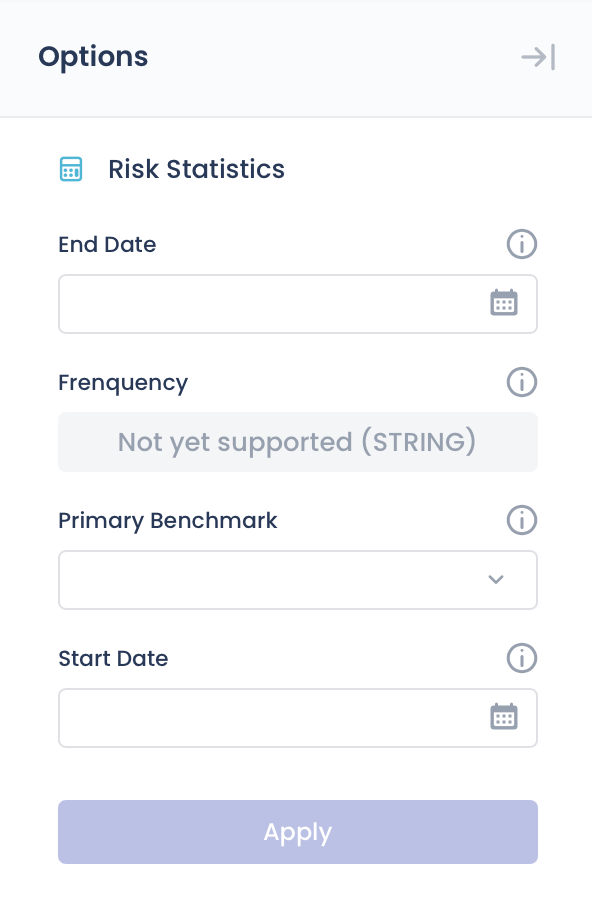

- **Primary Benchmark** - The main benchmark used for comparison.
- **Start, End Date** - Defines the time window used to calculate and display rolling period return statistics.