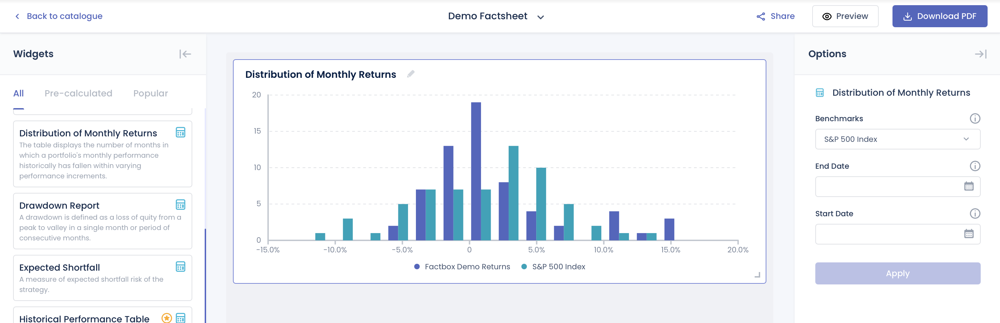
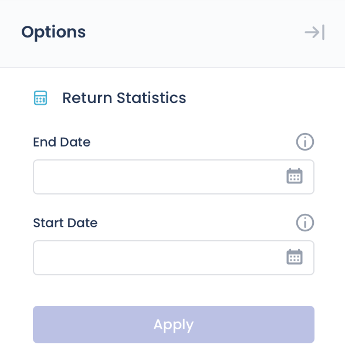
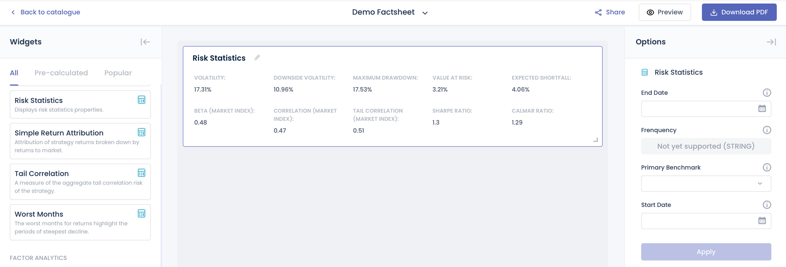
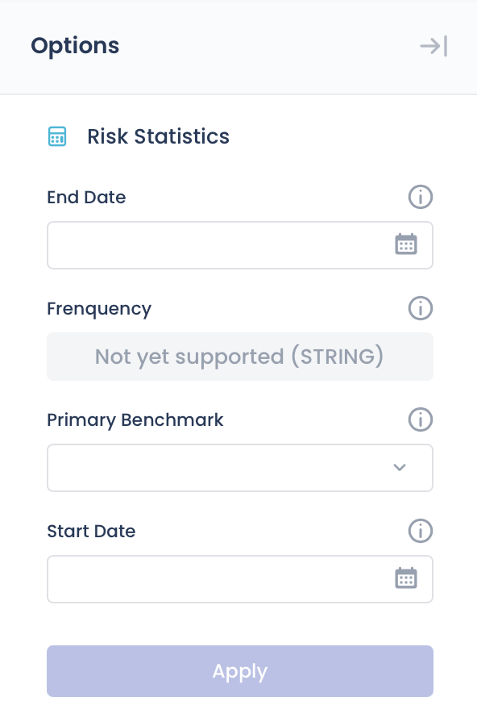

# Performance Analytics

## Cumulative Performance Chart

The cumulative performance of an investment represents the total percentage change in the asset’s price over a specific period.

The data for this chart will be pre-calculated based on the provided return data.


### Widget Options


- **Benchmarks** - Select a benchmark from the list.
- **Start, End Date** - Set the date range for the displayed data.

## Distribution of Monthly Returns

The chart displays the number of months in which a portfolio's monthly performance historically has fallen within varying performance increments.

The data for this chart will be pre-calculated based on the provided return data.



### Widget Options


- **Benchmarks** - Select a benchmark from the list.
- **Start, End Date** - Set the date range for the displayed data.

## Drawdown Report

A drawdown is defined as a loss of equity from a peak to a trough within a single month or over a consecutive period of months.

The data for this chart will be pre-calculated based on the provided return data.


### Widget Options


- **Top N Drawdowns** - Number of drawdown periods to display.
- **Start, End Date** - Set the date range for the displayed data.

## Expected Shortfall

Represents the expected shortfall risk associated with the returns data.

The data for this chart will be pre-calculated based on the provided return data.


### Widget Options


- **Confidence Level** - The probability that losses will not exceed the expected shortfall threshold. For example, a 95% confidence level means there is a 5% chance that losses will exceed the calculated expected shortfall.
- **Start, End Date** - Defines the time range over which the expected shortfall is calculated, based on the provided return data.

## Historical Performance Table

Analyzing historical performance data cah help you identify trends, by comparing historical data, you can spot upward and downward performance trends.

The data for this chart will be pre-calculated based on the provided return data.


### Widget Options


- **Start, End Date** - Sets the period for displaying historical performance metrics based on available return data.

## Performance and Risk Metrics

Performance and risk metrics are widely used to evaluate the performance of a portfolio, and forms a major component of portfolio management.

The data for this chart will be pre-calculated based on the provided return data.


### Widget Options


-**Benchmarks** - Compare performance metrics against selected benchmarks. Multiple selections allowed.
-**Prinmary Benchmark** - The main benchmark used for comparison.
- **Start, End Date** - Sets the time period for displaying historical performance metrics based on the available return data.

## Return Report

The return report represents best, worst, average, median and last returns of different rolling period.

The data for this chart will be pre-calculated based on the provided return data.


### Widget Options


- **Start, End Date** - Defines the time window used to calculate and display rolling period return statistics.

## Return Statistics

Return statistics show statistical measures for the return data provided.

- **CAGR** - Compound Annual Growth Rate; the annualized rate of return assuming profits are reinvested over the period.
- **3 Month ROR** - Return on investment over the last 3 months, showing short-term performance.
- **6 Month ROR** - Return over the past 6 months, capturing medium-term performance trends.
- **1 Year ROR** - Return over the last 12 months, indicating recent yearly performance.
- **3 Year ROR** - Cumulative return over the past 3 years, useful for evaluating longer-term results.
- **Year to Date ROR** - Return from the beginning of the calendar year up to the current date.
- **Total Return** -  The overall return over the entire period, including both capital gains and income.
- **Winning Month** - The percentage of months with positive returns during the evaluated period.
- **Avg Winning Month** - The average return in months where the performance was positive.
- **Avg Losing Month** - The average return in months where the performance was negative.

The data for this widget will be pre-calculated based on the provided return data.


### Widget Options



- **Start, End Date** - Defines the time window used to calculate and display rolling period return statistics.

## Risk Statistics

Display risk statistics properties.

The data for this widget will be pre-calculated based on the provided return data.



### Volatility
Volatility measures how much returns vary on average over a year, based on daily return fluctuations.

**🧮 Formula**

$$
\text{Annualized Volatility} = \sigma \times \sqrt{\text{Yearly Length}}
$$

Where:  
- $\sigma$: Standard deviation of the daily returns  
- $\text{Yearly Length}$: Number of trading periods per year (typically 252 for daily returns)

🧪 Python Code Example

```python
import numpy as np
import pandas as pd

def calculate_volatility(rets: pd.Series, scale: int = 252) -> float:
    """
    Calculate the annualized volatility (standard deviation) of returns.

    Args:
        rets: Series of periodic returns (e.g., daily or monthly)
        scale: Number of periods per year (252 for daily, 12 for monthly)

    Returns:
        Annualized volatility as a float
    """
    # Compute standard deviation of returns
    std_dev = rets.std()

    # Annualize the volatility
    volatility = std_dev * (scale ** 0.5)

    return volatility

```

### Downside Volatility
Measure of downside risk that focuses on returns that fall below the risk-free benchmark. The risk-free benchmark will depend on the geography where the strategy/product is denominated and the market traded. For US and Global strategies/products, we will be using the 13 week Treasury Bill rate.

**🧮 Formula**

$$
\text{Annual. Downside Volatility} =
\sqrt{
\frac{
\sum_{t=1}^{n} \left[ \min(R_{st} - R_{ft}, 0) \right]^2
}{n}
\times \text{Trading Days per Year}
}
$$

Where:  
- n: Total number of return observations  
- min(X, Y): Returns the smaller of X and Y; used to isolate negative excess returns  
- R_{st}: Strategy/Product return at time t  
- R_{ft}: Risk-free return at time t
- Trading Days per Year: 252

🧪 Python Code Example

```python
import numpy as np
import pandas as pd

def calculate_downside_volatility(excess_rets: pd.Series, scale: int = 252) -> float:
    """
    Calculate the annualized Downside Volatility from a series of excess returns.

    Downside Volatility focuses only on negative excess returns relative to a risk-free rate
    or benchmark, penalizing losses more than overall volatility.

    Args:
        excess_rets: Series of excess returns (strategy returns minus risk-free rate)
        scale: Number of periods per year (e.g., 252 for daily, 12 for monthly)

    Returns:
        Annualized downside volatility as a float
    """
    # Filter only negative excess returns
    negative_excess_rets = excess_rets[excess_rets < 0]

    # Square them, take the average (divide by total length of excess_rets, not just negative ones)
    downside_var = (negative_excess_rets**2).sum() / len(excess_rets)

    # Take square root of variance and scale it to annualize
    downside_volatility = (downside_var ** 0.5) * (scale ** 0.5)

    return downside_volatility

```

### Maximum Drawdown
The largest peak-to-trough decline in value during a specific period, showing the worst potential loss.
The **maximum drawdown** measures the largest peak-to-trough decline in cumulative returns over a given time period.

**🧮 Formula**

**🔹 Step 1: Compute Cumulative Returns**

Define the cumulative returns series $C$:

$$
C = [C_1, C_2, \dots, C_T]
$$

Where each cumulative return $C_t$ at time $t$ is:

$$
C_t = \prod_{i=0}^{t} (1 + R_i)
$$

- $R_i$: Return at time $i$  
- $t$: Index in the return series

---

**🔹 Step 2: Compute Drawdown Series**

Define the drawdown series $D$:

$$
D = [D_1, D_2, \dots, D_T]
$$

Each drawdown value $D_t$ is:

$$
D_t = \frac{C_t}{\max_{i=0}^{t}(C_i)} - 1
$$

- $\max_{i=0}^{t}(C_i)$: Maximum cumulative return up to time $t$

---

**🔹 Step 3: Compute Maximum Drawdown**

The **maximum drawdown** is the lowest point in the drawdown series (expressed as an absolute value):

$$
\text{Max Drawdown} = \left| \min(D) \right|
$$

Where:  
- $D$: The full drawdown time series  
- $\min(D)$: The worst drawdown observed

🧪 Python Code Example

```python
import numpy as np
import pandas as pd 

def cal_underrater(rets: pd.Series) -> pd.Series:
    """
    Calculate the drawdown series from a return series.

    Args:
        rets: A pandas Series of periodic returns (e.g., daily or monthly)

    Returns:
        A Series representing drawdowns at each time point
    """
    # Compute cumulative returns over time: (1 + r1) * (1 + r2) * ... * (1 + rt)
    cum_rets = (rets + 1).cumprod()

    # Track the running maximum of cumulative returns (i.e., historical peaks)
    peak = np.maximum.accumulate(cum_rets)

    # Calculate drawdown at each point: how far below the peak the cumulative return is
    underrater = cum_rets / peak - 1

    return underrater

```

### Value at Risk
Measures the extent of possible financial losses within the strategy/product over a specific time frame given a certain significance level (alpha). For the VaR, we will using the monthly returns as the input and the alpha specified will be 0.05.

**🧮 Formula**

$$
\text{Value at Risk} = Q(\alpha, \text{rets})
$$

Where:  
- $\alpha$: The significance level (e.g., 0.05 for 5%)
- $\text{rets}$: All historical returns of the strategy
- $Q$: Quantile function that returns the $\alpha$-th percentile of the return distribution

🧪 Python Code Example

```python
import numpy as np
import numpy.typing as npt
from typing import Dict

def calculate_var(rets: npt.ArrayLike, alpha: float = 0.05) -> float:
    """
    Calculate Value at Risk (VaR) at a given significance level.

    Args:
        rets: A NumPy array-like of strategy returns.
        alpha: Significance level (default is 0.05 for 5% VaR).

    Returns:
        The VaR value (a negative number indicating potential loss).
    """
    rets_array = np.asarray(rets)
    clean_rets = rets_array[~np.isnan(rets_array)]
    var = np.quantile(clean_rets, alpha)

    return var
```

### Expected Shortfall 
Measures the weighted average of the "extreme" losses in the tail of the distribution of possible returns, beyond the VaR cutoff point and given a certain significance level (alpha).

**🧮 Formula**

The **Expected Shortfall** (also called Conditional Value at Risk) is the **average loss** in the worst-case $\alpha$ fraction of return outcomes.

Given $\alpha < 0.05$:

$$
\text{ES} = \frac{1}{N_<} \sum_{i=1}^{N_<} x_i
$$

Where:  
- $N_<$: Number of returns less than the $\alpha$-quantile
- $x_i$: Each return in that worst $\alpha$ tail of the distribution

🧪 Python Code Example

```python
import numpy as np
import numpy.typing as npt

def calculate_empirical_expected_shortfall(rets: npt.ArrayLike, alpha: float = 0.05) -> float:
    """
    Calculate the empirical Expected Shortfall (ES) at a given significance level.

    Args:
        rets: A NumPy array-like of strategy returns.
        alpha: Significance level (default is 0.05).

    Returns:
        The ES value (mean of worst-case losses).
    """
    rets_array = np.asarray(rets)
    clean_rets = rets_array[~np.isnan(rets_array)]
    quantile = np.quantile(clean_rets, alpha)

    if alpha >= 0.5:
        es = clean_rets[clean_rets >= quantile].mean()
    else:
        es = clean_rets[clean_rets <= quantile].mean()

    return es
```

### Beta (Market Index)
Indicates sensitivity to market movements; a beta above 1 implies higher volatility than the market.

**🧮 Formula**

Beta measures the return data's sensitivity to market movements. It is derived from the **linear regression** of the return data against market returns.

$$
R_i = \beta R_m + \varepsilon
$$

Where:  
- $R_i$: Strategy returns  
- $R_m$: Market returns  
- $\beta$: Beta coefficient (our objective)  
- $\varepsilon$: Error term or residual, capturing the portion of returns not explained by the market

🧪 Python Code Example

```python
from typing import Union
import pandas as pd
import numpy as np
from statsmodels.api import OLS, add_constant

def calculate_beta(
    returns: Union[pd.Series, np.ndarray],
    market_rets: Union[pd.Series, np.ndarray]
) -> float:
    """
    Calculate Beta (Market Index) via linear regression of return data against market returns.

    Args:
        returns: Series or array of return data (e.g., from a strategy or portfolio).
        market_rets: Series or array of market returns (must be same length and aligned).

    Returns:
        Beta value as a float.
    """
    # Ensure both inputs are aligned pandas Series
    data = pd.concat([pd.Series(returns), pd.Series(market_rets)], axis=1).dropna()
    y = data.iloc[:, 0].values  # Return data
    X = add_constant(data.iloc[:, 1].values)  # Market returns with intercept

    # Perform linear regression
    model = OLS(y, X).fit()
    beta = model.params[1]  # Coefficient for market return

    return beta
```
!!! note
    The beta value is obtained from the fitted regression model. It corresponds to the coefficient of the market return (i.e., params[1]). A beta above 1 indicates greater volatility than the market; below 1 indicates lower sensitivity.

### Correlation (Market Index)
A measure that determines how the returns move in relation to the market. The market used depends on the geography where the returns are denominated and traded.

Correlation measures the strength and direction of the linear relationship between return data and market returns.

**🧮 Formula**

$$
\text{correlation} =
\frac{
\sum \left( (x - \bar{x})(y - \bar{y}) \right)
}{
\sqrt{
\sum (x - \bar{x})^2 \cdot \sum (y - \bar{y})^2
}
}
$$

Where:  
- $x$: Return data (e.g. from a strategy)  
- $y$: Market return data  
- $\bar{x}$: Mean of $x$  
- $\bar{y}$: Mean of $y$

🧪 Python Code Example

```python
import pandas as pd
from typing import Union

def calculate_correlation(
    returns: Union[pd.Series, str],
    market_returns: Union[pd.Series, str],
    data: pd.DataFrame
) -> float:
    """
    Calculate the Pearson correlation coefficient between return data and market returns.

    Args:
        returns: Name of the column or Series representing return data.
        market_returns: Name of the column or Series representing market return data.
        data: A DataFrame containing both return series.

    Returns:
        The correlation coefficient as a float.
    """
    # If inputs are column names, extract the columns from the DataFrame
    if isinstance(returns, str) and isinstance(market_returns, str):
        selected = data[[returns, market_returns]].dropna()
    else:
        selected = pd.concat([pd.Series(returns), pd.Series(market_returns)], axis=1).dropna()

    # Compute Pearson correlation and extract the off-diagonal value
    correlation = selected.corr().iloc[0, 1]

    return correlation

```

### Tail Correlation (Market Index)
Refers to the correlation between the extreme events or outliers of the returns and the market. The market will depend on the geography where the strategy is denominated and the market traded.

**🧮 Formula**

Tail Correlation measures the degree of co-movement between two return distributions in the tails — i.e., during extreme losses.

**🔹 Step 1: Standardize Returns**

Standardize the returns for series $i$ at each time $t$:

$$
Z_{i,t} = \frac{R_{i,t}}{\sigma_i}
$$

Where:  
- $R_{i,t}$: Return of series $i$ at time $t$  
- $\sigma_i$: Standard deviation of returns for series $i$  
- $i$: Can be the strategy (`strat`) or market (`mkt`)

---

**🔹 Step 2: Compute Weighted Portfolio Return**

Compute the weighted portfolio return series $Z_{p,t}$ at each time $t$:

$$
Z_{p,t} = Z_{\text{strat},t} \cdot w + Z_{\text{mkt},t} \cdot (1 - w)
$$

Where:  
- $w$: Weight assigned to the strategy  
- $Z_{\text{strat},t}$ and $Z_{\text{mkt},t}$: Standardized returns of the strategy and market

---

**🔹 Step 3: Compute Mean Return of Each Series**

For each return series $i$ (strategy, market, or portfolio):

$$
\mu_i = \frac{1}{N_i} \sum_{t=1}^{N_i} R_{i,t}
$$

Where:  
- $\mu_i$: Mean return of series $i$  
- $N_i$: Number of return observations for series $i$

---

**🔹 Step 4: Compute Expected Shortfall for Each Series**

Use the **Expected Shortfall** formula (from the ES section) to compute:

- $ES_{\text{strat}}$
- $ES_{\text{mkt}}$
- $ES_{p}$

---

**🔹 Step 5: Calculate Tail Correlation**

Finally, compute Tail Correlation:

$$
\text{Tail Correlation} =
\frac{
(ES_p - \mu_p)^2
- w^2 (ES_{\text{strat}} - \mu_{\text{strat}})^2
- (1 - w)^2 (ES_{\text{mkt}} - \mu_{\text{mkt}})^2
}{
2w(1 - w)(ES_{\text{strat}} - \mu_{\text{strat}})(ES_{\text{mkt}} - \mu_{\text{mkt}})
}
$$

🧪 Python Code Example

```python
from typing import Callable
import numpy as np

def calculate_tail_correlation(
    rets: np.ndarray,
    w: float = 0.5,
    func: Callable[[np.ndarray], float] = None,
    **kwargs
) -> float:
    """
    Calculate the tail correlation between two return series using Expected Shortfall.

    This measures co-movement in the extreme (left-tail) parts of the distributions.

    Args:
        rets: A 2D NumPy array of shape (T, 2), where each column is a return series
              (e.g., strategy and market), aligned by time.
        w: Weight of the first series (strategy) in the portfolio. Default is 0.5.
        func: Function to compute Expected Shortfall. It should accept a 1D array of returns
              and return a float. If None, an empirical ES function must be passed via kwargs.
        **kwargs: Additional arguments passed to the ES function (e.g., alpha=0.05).

    Returns:
        Tail correlation coefficient as a float.
    """
    if func is None:
        raise ValueError("Expected Shortfall function (func) must be provided.")

    # Remove rows with NaNs
    rets = rets[~np.isnan(rets).any(axis=1)]

    # Standardize both return series
    rets = rets / rets.std(axis=0)

    rets_1, rets_2 = rets[:, 0], rets[:, 1]
    rets_p = rets_1 * w + rets_2 * (1 - w)

    # Means of each series
    mu_1, mu_2, mu_p = rets_1.mean(), rets_2.mean(), rets_p.mean()

    # Expected Shortfall of each series
    es_1 = func(rets_1, **kwargs)
    es_2 = func(rets_2, **kwargs)
    es_p = func(rets_p, **kwargs)

    # Tail correlation formula
    numerator = (es_p - mu_p) ** 2 - w ** 2 * (es_1 - mu_1) ** 2 - (1 - w) ** 2 * (es_2 - mu_2) ** 2
    denominator = 2 * w * (1 - w) * (es_1 - mu_1) * (es_2 - mu_2)

    tail_correlation = numerator / denominator

    return tail_correlation

```

### Sharpe Ratio
Measure of the return data's risk-adjusted performance, calculated by comparing its return to that of a risk-free benchmark. The risk-free benchmark will depend on the geography where the returns are denominated and the market traded. For US and Global returns, we will be using the 13-week Treasury Bill rate.

**🧮 Formula**

The Sharpe Ratio measures the risk-adjusted performance of return data by comparing its excess returns (over a risk-free benchmark) to the standard deviation of those returns.

**🔹 Step 1: Compute Excess Returns**

At each time $t$, compute the excess return:

$$
R_{\text{excess},t} = R_{\text{strat},t} - R_{f,t}
$$

Where:  
- $R_{\text{strat},t}$: Return at time $t$  
- $R_{f,t}$: Risk-free return at time $t$

---

**🔹 Step 2: Compute Sharpe Ratio**

The Sharpe Ratio is calculated as:

$$
\text{Sharpe Ratio} = \frac{E(R_{\text{excess}})}{\sigma_{\text{excess}}} \times \sqrt{\text{YEARLY LENGTH}}
$$

Where:  
- $E(R_{\text{excess}})$: Mean of the excess returns  
- $\sigma_{\text{excess}}$: Standard deviation of the excess returns  
- $\text{YEARLY LENGTH}$: Number of trading days in a year (typically 252)


!!! note
    For US and global returns, the risk-free rate used is the 13-week Treasury Bill rate.

🧪 Python Code Example

```python
import numpy as np
import pandas as pd

def calculate_sharpe_ratio(excess_rets: pd.Series, scale: int = 252) -> float:
    """
    Calculate the annualized Sharpe Ratio from a series of excess returns.

    The Sharpe Ratio measures risk-adjusted return by comparing the mean of excess returns 
    to their standard deviation, scaled to the annual level.

    Args:
        excess_rets: Series of excess returns (e.g., returns minus risk-free rate).
        scale: Number of periods per year (252 for daily, 12 for monthly, etc.).

    Returns:
        Sharpe Ratio as a float.
    """
    mean_excess = excess_rets.mean()
    std_excess = excess_rets.std()

    if std_excess == 0:
        return np.nan  # avoid divide-by-zero

    sharpe_ratio = (mean_excess / std_excess) * np.sqrt(scale)

    return sharpe_ratio
```

### Calmar Ratio
Measure of risk-adjusted returns for investment funds such as hedge funds.

!!! note
    Calmar Ratio focuses on worst-case scenario through the maximum drawdown while the Sharpe Ratio considers overall volatility

**🧮 Formula**

The **Calmar Ratio** evaluates risk-adjusted performance by comparing the average excess return to the maximum drawdown. It is useful for strategies with high volatility, where drawdowns are a key concern.

**🔹 Step 1: Compute Excess Returns**

At each time $t$, calculate excess returns:

$$
R_{\text{excess},t} = R_{\text{strat},t} - R_{f,t}
$$

Where:  
- $R_{\text{strat},t}$: Strategy return at time $t$  
- $R_{f,t}$: Risk-free benchmark return at time $t$

---

**🔹 Step 2: Compute Maximum Drawdown**

Refer to the **Maximum Drawdown** section to calculate the worst peak-to-trough decline in cumulative returns over the period.

Let:
- $\text{Max Drawdown}$ be the maximum drawdown value (expressed as a positive number)

---

**🔹 Step 3: Compute Calmar Ratio**

The **Calmar Ratio** is calculated as:

$$
\text{Calmar Ratio} = \frac{E(R_{\text{excess}})}{\text{Max Drawdown}} \times \sqrt{\text{YEARLY LENGTH}}
$$

Where:  
- $E(R_{\text{excess}})$: Mean of excess returns  
- $\text{Max Drawdown}$: Absolute maximum drawdown  
- $\text{YEARLY LENGTH}$: Number of trading periods per year (typically 252 for daily returns)

!!! note
    The Calmar Ratio is especially helpful when assessing strategies with high drawdown sensitivity.

🧪 Python Code Example

```python
import numpy as np
import pandas as pd

def calculate_calmar_ratio(
    excess_rets: pd.Series, 
    max_drawdown: float, 
    scale: int = 252
) -> float:
    """
    Calculate the Calmar Ratio from excess returns and maximum drawdown.

    The Calmar Ratio measures risk-adjusted performance by comparing the mean
    of excess returns to the maximum drawdown, annualized.

    Args:
        excess_rets: Series of excess returns (strategy returns - risk-free rate).
        max_drawdown: Maximum drawdown value (as a positive float).
        scale: Number of trading periods per year (default: 252 for daily).

    Returns:
        Calmar Ratio as a float.
    """
    mean_excess = excess_rets.mean()

    if max_drawdown == 0:
        return np.nan  # avoid division by zero

    calmar_ratio = (mean_excess / max_drawdown) * scale
    
    return calmar_ratio
```

### Widget Options



- **Primary Benchmark** - The main benchmark used for comparison.
- **Start, End Date** - Defines the time window used to calculate and display rolling period return statistics.

## Simple Return Attribution
A bar chart widget that decomposes returns into components attributable to Alpha, Market, Factor, and Risk-Free contributions.


#### Widget Options


- **Market** - Represents the portion of returns attributable to market movements, based on the selected benchmark.
- **Start, End Date** - Defines the time period over which the return decomposition (Alpha, Market, Factor, Risk-Free) is calculated and displayed in the chart.

### Tail Correlation
A measure of the aggregated tail correlation risk of the returns. Refers to the correlation between the extreme events or outliers of the strategy and the market. The market will depend on the geography where the strategy is denominated and the market traded.


**🧮 Formula**

**🔹 Step 1: Standardize the Returns**

Standardize the returns for each series $i$ (strategy or market) at time $t$:

$$
Z_{i,t} = \frac{R_{i,t}}{\sigma_i}
$$

Where:  
- $R_{i,t}$: Return of series $i$ at time $t$  
- $\sigma_i$: Standard deviation of returns for series $i$

---

**🔹 Step 2: Compute Weighted Portfolio Returns**

Compute the weighted average of the standardized portfolio return at time $t$:

$$
Z_{p,t} = Z_{\text{strat},t} \cdot w + Z_{\text{mkt},t} \cdot (1 - w)
$$

Where:  
- $w$: Weight assigned to the strategy

---

**🔹 Step 3: Compute Mean of Each Series**

Calculate the mean return for each series $i$ (strategy, market, or portfolio):

$$
\mu_i = \frac{1}{N_i} \sum_{t=1}^{N_i} R_{i,t}
$$

Where:  
- $\mu_i$: Mean return of series $i$  
- $N_i$: Number of return observations for series $i$

---

**🔹 Step 4: Compute Expected Shortfall**

For each series $i$ (strategy, market, and portfolio), compute the **Expected Shortfall** using the formula defined in the Expected Shortfall section:

- $ES_{\text{strat}}$
- $ES_{\text{mkt}}$
- $ES_p$

---

**🔹 Step 5: Calculate Tail Correlation**

Use the following formula to calculate Tail Correlation:

$$
\text{Tail Correlation} =
\frac{
(ES_p - \mu_p)^2
- w^2 (ES_{\text{strat}} - \mu_{\text{strat}})^2
- (1 - w)^2 (ES_{\text{mkt}} - \mu_{\text{mkt}})^2
}{
2w(1 - w)(ES_{\text{strat}} - \mu_{\text{strat}})(ES_{\text{mkt}} - \mu_{\text{mkt}})
}
$$

---

This metric captures the **joint tail risk behavior** between the return's data and the market, going beyond traditional correlation by focusing on extreme downside events.

🧪 Python Code Example

```python
import numpy as np
from typing import Callable

def calculate_tail_correlation(
    returns: np.ndarray,
    w: float = 0.5,
    es_func: Callable[[np.ndarray], float] = None,
    **kwargs
) -> float:
    """
    Calculate tail correlation between two return series using expected shortfall.

    This function computes the tail correlation, which quantifies the dependence
    between two return distributions in the left tail (i.e., during extreme loss periods).

    Args:
        returns: A NumPy array of shape (T, 2), where each column represents a return series 
                 (e.g., strategy and market returns), aligned by time.
        w: Weight of the first return series in the combined portfolio (default: 0.5).
        es_func: Function to compute expected shortfall for a 1D array of returns.
        **kwargs: Additional keyword arguments passed to the expected shortfall function.

    Returns:
        Tail correlation as a float.
    """
    if es_func is None:
        raise ValueError("Expected shortfall function (es_func) must be provided.")

    # Remove rows with NaN values
    returns = returns[~np.isnan(returns).any(axis=1)]

    # Standardize each column (series)
    returns = returns / returns.std(axis=0)

    strat_returns = returns[:, 0]
    mkt_returns = returns[:, 1]
    port_returns = strat_returns * w + mkt_returns * (1 - w)

    # Mean returns
    mu_strat = strat_returns.mean()
    mu_mkt = mkt_returns.mean()
    mu_port = port_returns.mean()

    # Expected shortfalls
    es_strat = es_func(strat_returns, **kwargs)
    es_mkt = es_func(mkt_returns, **kwargs)
    es_port = es_func(port_returns, **kwargs)

    # Tail correlation formula
    numerator = (es_port - mu_port) ** 2 \
        - (w ** 2) * (es_strat - mu_strat) ** 2 \
        - ((1 - w) ** 2) * (es_mkt - mu_mkt) ** 2

    denominator = 2 * w * (1 - w) * (es_strat - mu_strat) * (es_mkt - mu_mkt)

    return numerator / denominator

```

### Widget Options


- **Primary Benchmark** - The main market benchmark used to attribute and compare components of the returns.
- **Start, End Date** - Specifies the time window over which rolling period return statistics are calculated.

## Worst Months
A grouped bar chart displaying the 5 worst performing months of the return's data compared against its benchmark and market returns.
The benchmark and market will depend on the geography where the strategy/product is denominated and the market traded.


**🧮 Formula**

For each month $i$, the daily returns within that month are compounded to calculate the monthly return $M_i$:

$$
M_i = \left[ \prod_{j=1}^{n} (1 + R_j) \right] - 1
$$

Where:  
- $M_i$: Monthly return for the $i^{th}$ month  
- $R_j$: Daily return for the $j^{th}$ day within the month  
- $n$: Number of trading days in month $i$

---

**🔹 Ranking and Visualization**

Once monthly returns are computed for the full time range:
- The returns are ranked from best to worst
- The **5 worst monthly returns** are selected and plotted as a bar chart

This helps visualize downside risks and identify periods of extreme underperformance.

🧪 Python Code Example

```python
import pandas as pd
from typing import List

def calculate_worst_months(
    daily_returns: pd.DataFrame,
    return_columns: List[str],
    sort_by: str,
    num_worst_months: int = 5
) -> pd.DataFrame:
    """
    Calculate the worst-performing months based on compounded monthly returns.

    Args:
        daily_returns: A DataFrame of daily returns (values should be in decimal format, e.g., 0.01 for 1%).
        return_columns: List of column names to include in the calculation (e.g., strategy, benchmark, market).
        sort_by: Column name to sort the monthly returns by (typically the market).
        num_worst_months: Number of worst months to return (default: 5).

    Returns:
        A DataFrame containing the `num_worst_months` with the lowest returns in the `sort_by` column.
    """
    # Select relevant columns and fill missing values with 0
    rets = daily_returns[return_columns].fillna(0)

    # Calculate monthly compounded returns
    monthly_returns = (rets + 1).groupby(pd.Grouper(freq='M')).prod() - 1

    # Sort by the target column and return the worst-performing months
    worst_months = monthly_returns.sort_values(by=sort_by).head(num_worst_months)

    return worst_months
```

### Widget Options


- **Benchmarks** - One or more market benchmarks used to compare and contextualize the returns.
- **Start, End Date** - Specifies the time window over which monthly return statistics are aggregated and analyzed.
- **Top N Worst Months** - Defines how many of the worst-performing months (based on the selected return series) will be identified and displayed.